<!-- Repository Information & Links-->
<br />


[![LinkedIn][linkedin-shield]][linkedin-url]
[![Instagram][instagram-shield]][instagram-url]
[![Behance][behance-shield]][behance-url]

<!-- HEADER SECTION -->
<h5 align="center" style="padding:0;margin:0;">Wolf Botha</h5>
<h5 align="center" style="padding:0;margin:0;">21100255</h5>
<h6 align="center">Interactive Development 300 • 2025</h6>
</br>
<p align="center">

  <a href="https://github.com/WolfOWI/nebulog" align="center">
    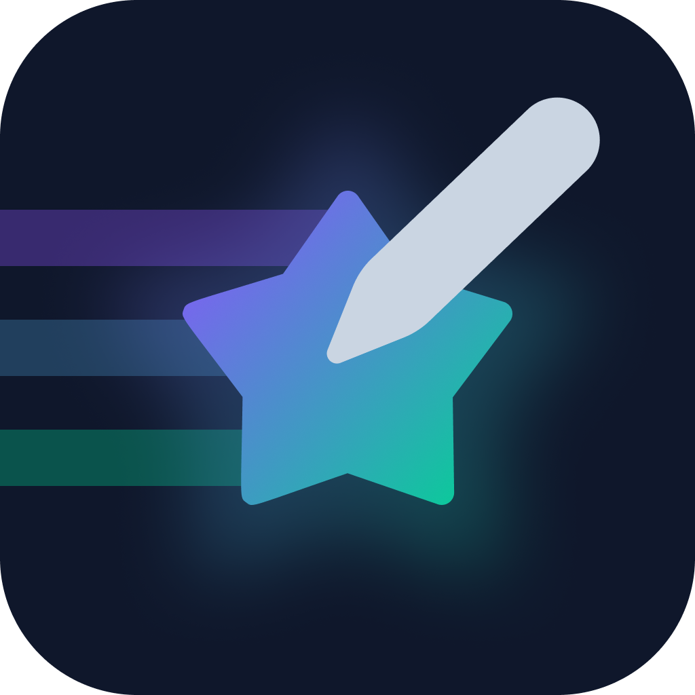
  </a>
  
  <h3 align="center">Nebulog</h3>

  <p align="center">
    A cosmic social reflection platform where thoughts become digital constellations<br>
      <a href="https://github.com/WolfOWI/nebulog"><strong>Explore the docs »</strong></a>
   <br />
   <br />
   <br />
   <a href="https://github.com/WolfOWI/nebulog/issues">Report Bug</a>
    ·
    <a href="https://github.com/WolfOWI/nebulog/issues">Request Feature</a>
</p>

<!-- TABLE OF CONTENTS -->

## Table of Contents

- [Table of Contents](#table-of-contents)
- [About the Project](#about-the-project)
  - [Project Description](#project-description)
  - [Project Inspiration \& Constraints](#project-inspiration--constraints)
  - [Built With](#built-with)
- [Getting Started](#getting-started)
  - [Prerequisites](#prerequisites)
  - [Installation](#installation)
- [Features and Functionality](#features-and-functionality)
  - [Authentication System](#authentication-system)
  - [Thought Launching](#thought-launching)
  - [Interactive Map](#interactive-map)
  - [Profile Customisation](#profile-customisation)
  - [Echo System](#echo-system)
  - [Streak Tracking](#streak-tracking)
  - [Mood System](#mood-system)
  - [Location Services](#location-services)
- [Nebulog Screens](#nebulog-screens)
  - [Authentication Screens](#authentication-screens)
  - [Core App Screens](#core-app-screens)
  - [Profile Screens](#profile-screens)
- [Architecture \& Components](#architecture--components)
  - [Component Structure](#component-structure)
  - [State Management](#state-management)
  - [API Integration](#api-integration)
- [Concept Process](#concept-process)
  - [Ideation](#ideation)
  - [Wireframes](#wireframes)
- [Development Process](#development-process)
  - [Implementation Process](#implementation-process)
    - [Highlights](#highlights)
    - [Challenges](#challenges)
  - [Future Implementation](#future-implementation)
- [Final Outcome](#final-outcome)
  - [Mockups](#mockups)
- [Conclusion](#conclusion)
- [Roadmap](#roadmap)
- [Contributing](#contributing)
- [Authors](#authors)
- [License](#license)
- [Contact](#contact)
- [Acknowledgements](#acknowledgements)

<!--PROJECT DESCRIPTION-->

## About the Project

<!-- header image of project -->

![Project Header][project-header]

### Project Description

Nebulog is a location-based reflection platform that transforms inner thoughts and feelings into a digital cosmos of shared experiences. Built as a React Native mobile application with Expo, it allows users to launch their reflections into the universe, creating a constellation of thoughts that can be discovered by others through an interactive map. Centred around the theme of space, Nebulog aims to encourage users to build the habit of self-reflection, with daily streak-tracking and a unique space-themed style and aesthetic.

### Project Inspiration & Constraints

This project was developed based on three key inspiration cards that shaped the entire concept and implementation:

**Goal Card: Build a Habit**

- The core objective was to create an application that encourages users to develop a daily habit
- Implemented through the streak tracking system that motivates users to reflect daily

**Interaction Card: Geolocation**

- The primary interaction method revolves around location-based features
- Users can discover reflections from others in their vicinity through the interactive map
- Location services enable place-based reflection sharing and discovery

**Constraint Card: No Traditional UI Buttons**

- Traditional button elements were completely avoided throughout the interface
- Replaced with gesture-based interactions, swipe controls, and hold-to-activate mechanisms

### Built With

- Mobile Framework: [React Native](https://reactnative.dev/)
- Development Platform: [Expo](https://expo.dev/)
- Language: [TypeScript](https://www.typescriptlang.org/)
- Styling: [NativeWind](https://www.nativewind.dev/) (Tailwind CSS for React Native)
- UI Components: [Gluestack UI](https://ui.gluestack.io/)
- State Management: [React Context API](https://react.dev/reference/react/createContext)
- Backend: [Firebase](https://firebase.google.com/)
- Authentication: [Firebase Auth](https://firebase.google.com/docs/auth)
- Database: [Firestore](https://firebase.google.com/docs/firestore)
- Maps: [React Native Maps](https://github.com/react-native-maps/react-native-maps) (with Google Maps integration)
- Location Services: [Expo Location](https://docs.expo.dev/versions/latest/sdk/location/)
- Google Places: [Google Places API](https://developers.google.com/maps/documentation/places/web-service/overview)
- Animations: [Lottie React Native](https://github.com/lottie-react-native/lottie-react-native)
- Icons: [Expo Vector Icons](https://docs.expo.dev/guides/icons/)
- Form Validation: [Validator.js](https://github.com/validatorjs/validator.js)
- Date Handling: [Day.js](https://day.js.org/)
- Colour Picker: [React Native Wheel Color Picker](https://github.com/elderhs/react-native-wheel-color-picker)
- Geolocation: [GeoFire](https://github.com/firebase/geofire-js)

<!-- GETTING STARTED -->

## Getting Started

The following instructions will get you a copy of the project up and running on your local machine for development and testing purposes.

### Prerequisites

Ensure that you have the following installed on your machine:

- [Node.js](https://nodejs.org/) (v16 or higher)
- [npm](https://www.npmjs.com/) (comes bundled with Node.js)
- [Expo CLI](https://docs.expo.dev/get-started/installation/) - Install globally with `npm install -g @expo/cli`
- [Expo Go](https://expo.dev/client) app on your mobile device for testing

### Installation

Here are the steps to clone and set up this repo:

1. **Clone Repository**  
   Run the following in the command-line to clone the project:

   ```sh
   git clone https://github.com/WolfOWI/nebulog.git
   ```

2. **Navigate to Project Directory**

   ```sh
   cd nebulog/nebulog-app
   ```

3. **Install Dependencies**  
   Run the following to install all required dependencies:

   ```sh
   npm install
   ```

4. **Environment Setup**  
   Create a `.env` file in the `nebulog-app` directory and configure the following environment variables:

   ```env
   # Firebase Configuration
   FIREBASE_API_KEY=your_firebase_api_key
   FIREBASE_AUTH_DOMAIN=your_project.firebaseapp.com
   FIREBASE_DATABASE_URL=https://your_project.firebaseio.com
   FIREBASE_PROJECT_ID=your_project_id
   FIREBASE_STORAGE_BUCKET=your_project.appspot.com
   FIREBASE_MESSAGING_SENDER_ID=your_sender_id
   FIREBASE_APP_ID=your_app_id

   # Google Maps API
   GOOGLE_PLATFORM_API_KEY=your_google_maps_api_key
   ```

5. **Development Mode**  
   Start the application in development mode:

   ```sh
   npm start
   ```

6. **Run on Device**
   - Scan the QR code with Expo Go app (iOS/Android)
   - Or press `i` for iOS simulator or `a` for Android emulator

<!-- FEATURES AND FUNCTIONALITY-->

## Features and Functionality

### Authentication System

- **Email & Password Authentication**

  - User registration with username, email, and password
  - Secure login with validation
  - Username uniqueness validation

- **User Session Management**
  - Persistent authentication state
  - Automatic session validation
  - Secure token handling

### Thought Launching

- **Thought Composition**

  - Text-based reflections (up to 300 characters)
  - Mood selection with space-themed categories
  - Location-based or private reflections
  - Real-time character count tracking

- **Mood System**
  - 12 unique mood categories (Joy, Gratitude, Growth, Connection, Stillness, Wonder, Anger, Turbulence, Sadness, Grief, Lost)
  - Each mood has associated space objects and colours
  - Visual mood representation with custom icons

### Interactive Map

- **Map Interface**

  - Google Maps integration with custom styling
  - Real-time location services
  - Interactive markers for public reflections
  - Location-based reflection discovery

- **Geolocation Features**
  - Automatic user location detection
  - Place search and selection
  - Geofire integration for location queries (searching using geohashes)

### Profile Customisation

- **Profile Avatar**

  - 50+ space-themed icon options (UFOs, planets, stars, etc.)
  - Customisable profile colours with colour wheel picker

- **User Statistics**
  - Reflection streak tracking
  - Total reflections count
  - Echo count (likes received)
  - Personal bio and information

### Echo System

- **Reflection Interaction**

  - Like/unlike reflections (called "echoes")
  - Echo count tracking
  - User echo list

- **Content Discovery**
  - Location-based content discovery (on map)
  - User profile exploration

### Streak Tracking

- **Daily Reflection Tracking**
  - Consecutive day counting
  - Automatic streak validation
  - Streak reset on missed days

### Mood System

- **Mood Categories**
  - **Joy**: Happiness, Hope, Excitement (Shooting Star)
  - **Gratitude**: Thankfulness, Appreciation, Nostalgia (Glowing Star)
  - **Growth**: Change, Restarting, Evolving (Catalyst Rocket)
  - **Connection**: Belonging, Empathy, Love (Twin Stars)
  - **Stillness**: Peace, Calm, Serenity (Crystal Moon)
  - **Wonder**: Curiosity, Awe, Amazement (Nebula Bloom)
  - **Anger**: Frustration, Rage, Irritation (Meteor Storm)
  - **Turbulence**: Anxiety, Shame, Confusion (Solar Flare)
  - **Sadness**: Shame, Disappointment, Melancholy (Frozen Planet)
  - **Grief**: Emptiness, Loss, Despair (Black Hole)
  - **Lost**: Lonely, Stuck, Directionless (Lost Satellite)

### Location Services

- **Location Management**

  - GPS location detection
  - Place search and selection (with biased search based on user's location)
  - Address formatting and validation

- **Privacy Controls**
  - Public vs private reflection options

## Nebulog Screens

### Authentication Screens

**Onboarding** (`/`)

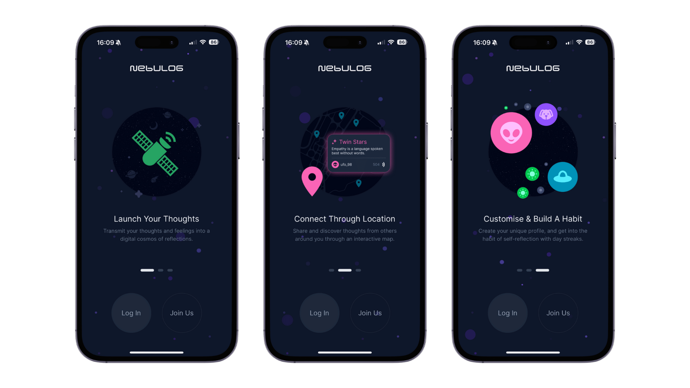

The Onboarding screen introduces users to Nebulog's core concepts through an interactive carousel. It features three key sections: "Launch Your Thoughts" explaining the reflection system, "Connect Through Location" describing the map-based discovery, and "Customise & Build A Habit" highlighting profile customisation and streak tracking. The background features star-sky-like animations and space-themed imagery to set the cosmic tone and create a good first impression for users.

**Login & Signup** (`/(auth)/login` & `/(auth)/signup`)

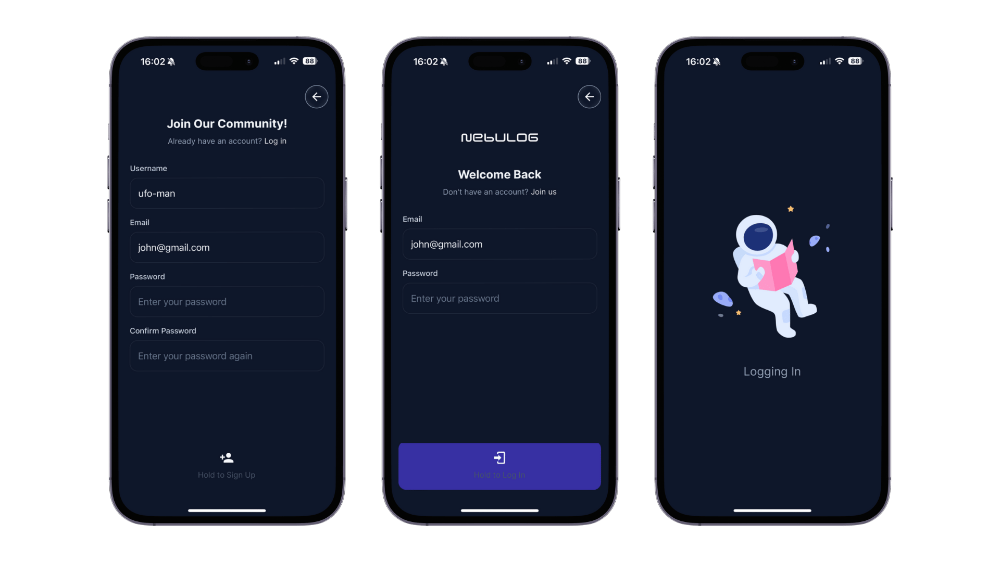

Both the Login & Signup screens feature real-time validation (including username uniqueness, email format and password checking). Both screens utilise Firebase Authentication for secure email-based login, with automatic session persistence that allows returning users to bypass the login process and go straight to the home screen.

### Core App Screens

**Home** (`/(app)/home`)

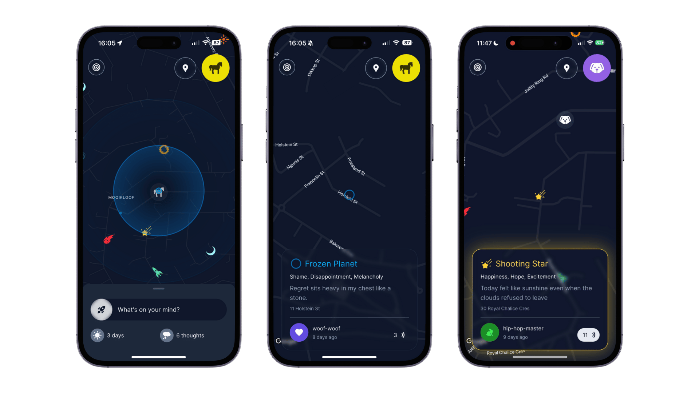

The Home screen serves as the heart of the Nebulog app, featuring an interactive map where users can discover public reflections from others. It displays the user's current streak, total reflections, and provides quick access to launch new thoughts. Users can simply tap on a reflection to read it, and if they like it, they can hold the reflection to "echo" / like it, which will store it to their echoed reflections list on their profile screen. Furthermore, users can also tap anywhere on the map to create a reflection based on the selected location.

**Thought Launch** (`/(app)/thoughtlaunch`)

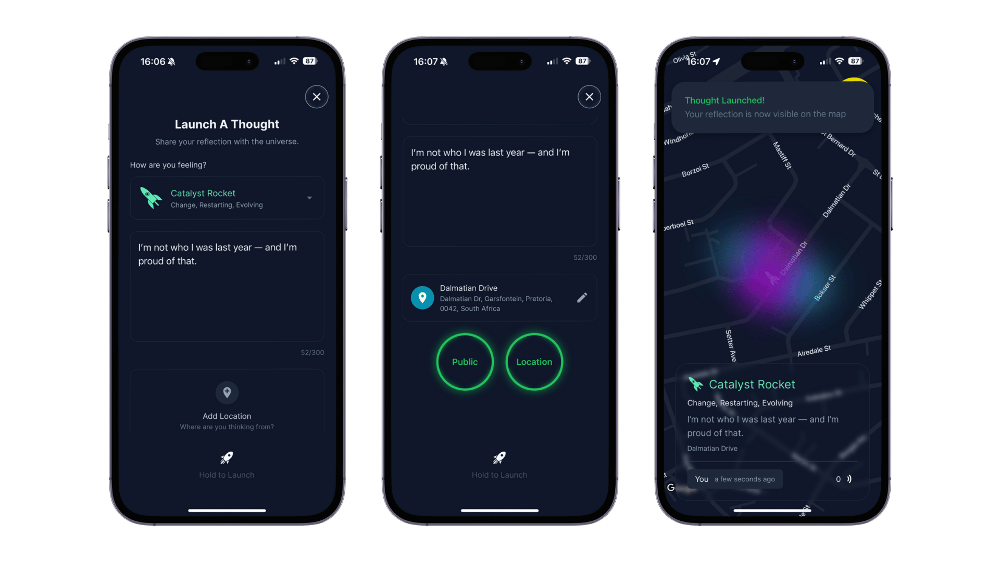

The Thought Launch screen is where users create and share their reflections. It features a mood selector with space-themed categories, text input with a character limit display (300 character limit), location selection, and privacy controls. After filling out the form, users hold down on the bottom button until a shaking animation plays, and upon release, will create the reflection, and show the user on the home screen's map.

**Location Search** (`/(app)/locationsearch`)

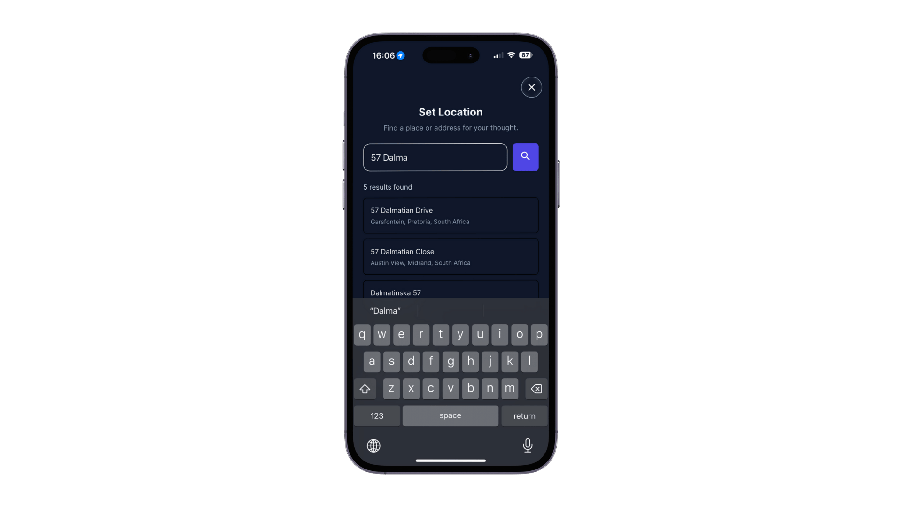

Part of the thought launch process - a dedicated location selection interface that allows users to search for specific places or use their current location. It integrates with Google Places API for real place suggestions (both street addresses and businesses), and is optimised to use 'biased search', which prioritises place results located near the user.

### Profile Screens

**My Profile** (`/(app)/myprofile`)

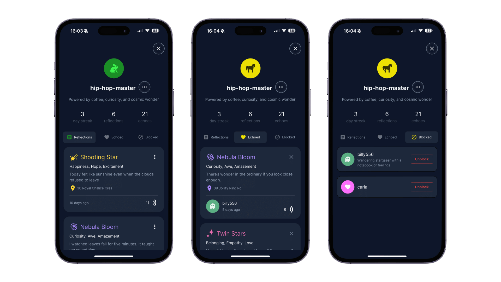

The My Profile screen displays the user's personal information, reflection history, and statistics. It includes tabs for personal reflections, echoed reflections from others, and blocked users management. Users can edit their profile, view their streak progress, manage their own reflections (either edit or delete posts), 'un-echo' reflections they echoed, and manage their list of blocked users.

**User Profile** (`/(app)/userprofile/:id`)

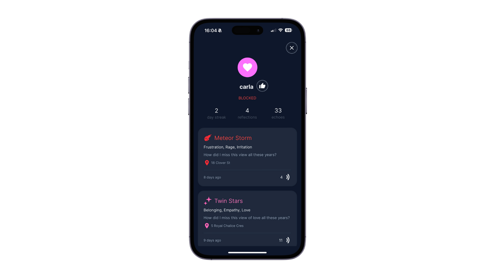

Similar to the My Profile screen, the User Profile screen displays the info of a user that is not the logged in user. It also shows their profile info and statistics, but only their public reflections. On this screen, users can view others' content, and block users if needed. Once a user is blocked, that user will no longer see any reflections created by the blocked user (both on the map or in their echoed reflections list).

**Edit Profile** (`/(app)/editprofile`)

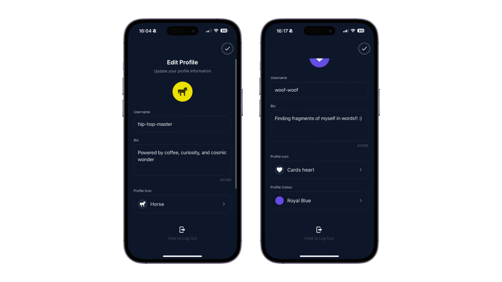

On the Edit Profile screen, users can update their username, bio, profile icon, and profile colour. It includes the custom colour picker and icon selection system, with real-time previews of changes.

**Profile Colour Pick** (`/(app)/profilecolourpick`)

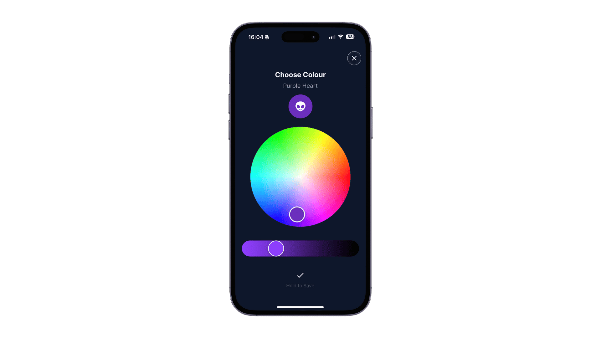

A dedicated colour selection screen featuring a custom colour wheel picker. Users can select from predefined colour palettes or create custom colours for their profile, with immediate preview of how the colour will look on their avatar. This screen also utilises a custom hex-color-to-names library, which converts the selected hex colour name to an English name.

**Profile Icon Select** (`/(app)/profileiconselect`)

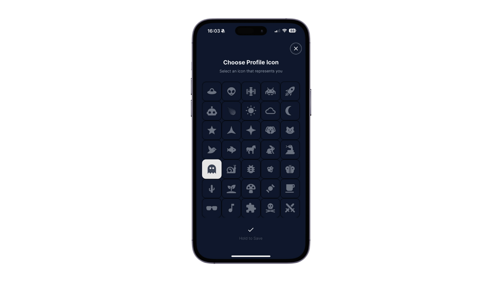

An icon selection interface displaying all available space-themed profile icons (and some non-space related for variety). Users can browse through icons like space objects, animals, nature, and objects to find the perfect representation of their identity, without needing to upload profile pictures. This design choice reflects Nebulog's philosophy of focusing on inner thoughts and reflections rather than external appearances, creating a more inclusive and content-focused social experience.

## Architecture & Components

### Component Structure

The application follows a modular component architecture:

**Custom UI Components**

- **Buttons**: `LaunchButton`, `CircleHoldBtn`, `LeftwardSwipeBtn` - Custom interactive buttons
- **Cards**: `MyReflectionCard`, `UserReflectionCard`, `EchoedReflectionCard` - Content display components
- **Avatars**: `ProfileAvatar`, `ProfileIcon` - User representation components
- **Map Related**: `Map`, `ReflectionDetailPanel`, `LocSelectCreateBox` - Location and mapping features
- **Loading**: `LoadingScreen` - Application loading states
- **Animations**: `AnimatedElement` - Lottie animation integration

### State Management

- **Context API**: Global state management for user authentication and location services
- **Local State**: Component-level state with React hooks
- **Form State**: Controlled form inputs with validation
- **Real-time Updates**: Firebase listeners for live data synchronisation

### API Integration

**Firebase Services**

- **Authentication**: User login, registration, and session management
- **Firestore**: Real-time database for reflections, users, and interactions
- **Geolocation**: Location-based queries and spatial indexing

**External APIs**

- **Google Maps**: Interactive mapping and place services
- **Google Places**: Location search and address formatting
- **Geofire**: Spatial database queries for location-based content

<!-- CONCEPT PROCESS -->

## Concept Process

### Ideation

<br>

![Ideation][ideation-pic]

Nebulog was conceived as a unique approach to digital journaling and social connection, directly inspired by the three project cards. Today, many people struggle with:

- Healthy expression of inner thoughts
- Feeling emotionally understood
- Being present in the moment
- Building habits of inner emotional awareness

Nebulog aims to address these issues by offering an anonymous space to reflect and connect with others - all tied to real places and gentle habit-forming mechanics.

**Key Design Principles**

- **Cosmic Aesthetic**: Space theme to make reflection feel like an adventure / an exploration of the inner "universe"
- **Location-Based Discovery**: Connecting people through shared spaces and experiences (Geolocation Card)
- **Mood Expression**: Visual representation of emotions through space objects
- **Habit Formation**: Streak tracking to encourage daily reflection (Build a Habit Card)
- **Gesture-Based Interaction**: Innovative controls without traditional buttons (No Traditional UI Buttons Card)

### Wireframes

![Wireframes][wireframes]

<!-- DEVELOPMENT PROCESS -->

## Development Process

The `Development Process` is the technical implementations and functionality done in the frontend and backend of the application.

### Implementation Process

**Architecture Decisions**

- **React Native + Expo**: Chosen for cross-platform mobile development and rapid prototyping
- **TypeScript**: Implemented for type safety and better developer experience
- **Firebase**: Selected for backend services due to real-time capabilities and scalability
- **GlueStack UI NativeWind**: Utilised for consistent styling and rapid UI development

**Key Technical Implementations**

- **Real-time Database**: Firestore integration with live listeners (for post like/unlike updates)
- **Location Services**: GPS integration with Google Maps and Places API
- **Authentication System**: Secure user management with Firebase Auth
- **Geospatial Queries**: Location-based content discovery using Geofire (cannot rely solely on latitude & longitude)
- **Custom Animations**: Lottie integration for engaging user experience

#### Highlights

**Interactive Map**

- Google Maps integration with custom styling and custom markers, efficient geospatial queries using Geofire, and real-time location-based reflection discovery based on user location or selected places.

**Mood Stylisation**

- Moods are visually represented with space-themed icons and custom colour schemes, creating an engaging and interesting emotional means of expression.

**Custom Buttons & Animations**

- Custom swiping and hold-to-activate buttons were implemented throughout the interface, providing unique interaction patterns that replace traditional UI elements.

#### Challenges

**Maps Integration**

- Tricky map implementation challenges including unexpected bugs, inconsistent animations, and unpredictable behaviour that required extensive and frequent debugging.

**Cross-Platform Compatibility**

- Maintaining consistent UI behaviour across iOS and Android
- Android-specific issues with z-index layering and content visibility, particularly affecting the custom gesture-based buttons

**Custom Button Implementation**

- Gesture detection reliability issues and app stability challenges when implementing custom interaction patterns, requiring careful testing and different approaches to implementation.

### Future Implementation

**Enhanced Social Features**

- Comment system for reflections to enable deeper discussions and community engagement
- User following and friend connections to build meaningful relationships

**Map Features**

- Sorting and filtering of reflections by mood, author, date, and location
- Emotional heatmaps and hotspots to visualise mood patterns across different areas

**Notifications & Engagement**

- Push notifications for reflection interactions (likes, comments, new followers)
- Streak reminders and motivational notifications to encourage daily reflection

<!-- MOCKUPS -->

## Final Outcome

### Mockups

![Final Mockup 1][final-mockup-1]

<br>

![Final Mockup 2][final-mockup-2]

## Conclusion

![Conclusion Summary][conclusion-summary]

Nebulog successfully combines the therapeutic benefits of personal reflection with the social aspect of shared experiences. The space-themed aesthetic and location-based discovery create a unique platform that encourages daily reflection while building meaningful connections between users. The technical implementation demonstrates modern mobile development practices with a focus on user experience and performance.

The final application delivers a social reflection platform with the following key features:

- **Space-Themed Interface** - Cosmic aesthetic with custom animations and visual elements
- **Gesture-Based Interactions** - Custom button components and swipe/hold controls replacing traditional UI elements
- **Location-Based Discovery** - Interactive map with real-time reflection sharing and discovery
- **Habit Tracking System** - Daily streak counting to encourage regular reflection
- **Cross-Platform Compatibility** - Consistent experience across iOS and Android devices

## Roadmap

See the [open issues](https://github.com/WolfOWI/nebulog/issues) for a list of proposed features and known issues.

## Contributing

Contributions are what make the open-source community such an amazing place to learn, inspire, and create. Any contributions you make are **greatly appreciated**.

1. Fork the Project
2. Create your Feature Branch (`git checkout -b feature/AmazingFeature`)
3. Commit your Changes (`git commit -m 'Add some AmazingFeature'`)
4. Push to the Branch (`git push origin feature/AmazingFeature`)
5. Open a Pull Request

## Authors

- **Wolf Botha** - [WolfOWI](https://github.com/WolfOWI)

## License

Distributed under the MIT License. See `LICENSE` for more information.

## Contact

- **Wolf Botha** - [wolfmeyerbotha@gmail.com](mailto:wolfmeyerbotha@gmail.com) - [@wolfbotha](https://www.instagram.com/wolfbotha)
- **Project Link** - https://github.com/WolfOWI/nebulog

## Acknowledgements

**Technologies and Libraries**

- [React Native](https://reactnative.dev/) - Mobile app development framework
- [Expo](https://expo.dev/) - Development platform and tools
- [Firebase](https://firebase.google.com/) - Backend services and infrastructure
- [NativeWind](https://www.nativewind.dev/) - Tailwind CSS for React Native
- [Gluestack UI](https://ui.gluestack.io/) - Modern component library
- [Lottie](https://lottiefiles.com/) - Animation framework and assets

**Design and Development Tools**

- [Figma](https://www.figma.com/) - Design and prototyping
- [GitHub](https://github.com/) - Version control and collaboration
- [Expo Dev Tools](https://docs.expo.dev/workflow/development-builds/) - Development and debugging

<!-- MARKDOWN LINKS & IMAGES -->

[project-header]: ./docs/project-header.png
[ideation-pic]: ./docs/ideation-pic.png
[wireframes]: ./docs/wireframes.png
[onboarding-screen]: ./docs/onboarding-screen.png
[auth-screens]: ./docs/auth-screens.png
[home-screen]: ./docs/home-screen.png
[thought-launch-screen]: ./docs/thought-launch-screen.png
[location-search-screen]: ./docs/location-search-screen.png
[my-profile-screen]: ./docs/my-profile-screen.png
[user-profile-screen]: ./docs/user-profile-screen.png
[edit-profile-screen]: ./docs/edit-profile-screen.png
[profile-colour-pick-screen]: ./docs/profile-colour-pick-screen.png
[profile-icon-select-screen]: ./docs/profile-icon-select-screen.png
[final-mockup-1]: ./docs/final-mockup-1.png
[final-mockup-2]: ./docs/final-mockup-2.png
[conclusion-summary]: ./docs/conclusion-summary.png

<!-- Shields & Urls -->

[linkedin-shield]: https://img.shields.io/badge/-LinkedIn-black.svg?style=flat-square&logo=linkedin&colorB=555
[linkedin-url]: https://www.linkedin.com/in/wolfbotha
[instagram-shield]: https://img.shields.io/badge/-Instagram-black.svg?style=flat-square&logo=instagram&colorB=555
[instagram-url]: https://www.instagram.com/wolfbotha/
[behance-shield]: https://img.shields.io/badge/-Behance-black.svg?style=flat-square&logo=behance&colorB=555
[behance-url]: https://www.behance.net/wolfbotha
